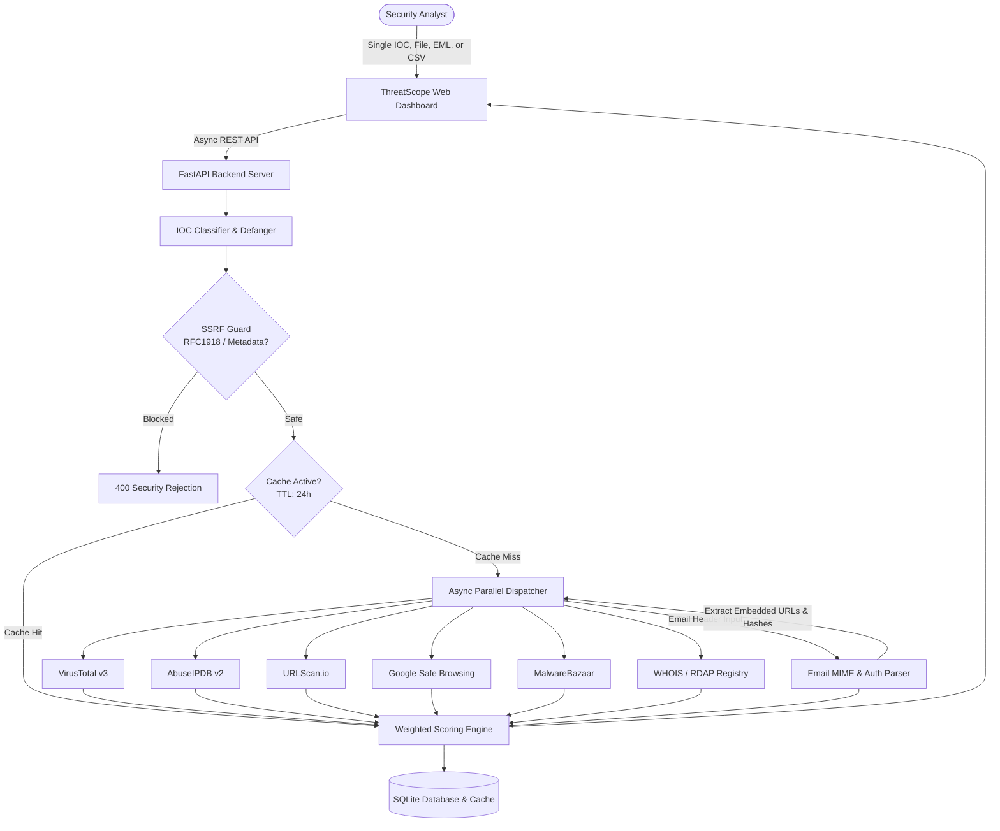

# ThreatScope — Unified Threat Detection Tool (Multi-IOC Scanner)

**ThreatScope** is a full-stack unified threat intelligence and Indicator of Compromise (IOC) scanning platform. It accepts any IOC type (IPs, URLs, Domains, Hashes, Files, Emails, and raw RFC 5322 headers), automatically refangs indicators for multi-provider querying, aggregates results into a weighted risk score (0–100) and categorical verdict, performs cascading email sub-scans, and caches findings with a unified threat intelligence interface.

---

## Key Features

- **Automatic IOC Auto-Detection & Defanging**: Live typing classification for IPv4, IPv6, URLs, Domains, MD5, SHA-1, SHA-256, Emails, and raw Header dumps. Handles defanged notations like `hxxps[://]`, `192[.]168[.]1[.]1`, `user[at]bad[.]site`.
- **Multi-Source Threat Intelligence**:
  - **VirusTotal v3**: File hashes, URLs, domains, and IP reputation.
  - **AbuseIPDB v2**: IP blacklist confidence and malicious abuse reports.
  - **URLScan.io**: Automated sandbox DOM scanning and screenshots.
  - **Google Safe Browsing v4**: Phishing and malware detection.
  - **MalwareBazaar (abuse.ch)**: Real-time malware binary signatures and tags.
  - **WHOIS / RDAP**: Automated domain age penalty calculations (newly registered domains < 14 days flagged).
  - **Built-in Mock Fallbacks**: App runs seamlessly out-of-the-box with realistic intelligence simulations if API keys are not supplied.
- **Cascading Email & Header Inspector**:
  - Validates SPF, DKIM, and DMARC authentication status.
  - Detects sender impersonation and spoofing (`From` vs `Return-Path` mismatch).
  - Automatically extracts all embedded URLs and attachment hashes, cascading them into individual sub-scans that influence the parent email verdict.
- **Client-Side File Hashing & Upload**:
  - Computes MD5, SHA-1, and SHA-256 client-side using the Web Crypto API before scanning.
- **Bulk Multi-IOC Scanning**:
  - Scan up to 100 mixed IOCs via textarea or CSV upload with concurrency controls and batch CSV export.
- **24-Hour Cache & Audit Log**:
  - SQLite database caching layer respects API rate limits by caching results for 24 hours.
  - Searchable scan audit history with filtering by IOC type, verdict, and CSV download.
- **SSRF Protection & Safe Defanged Presentation**:
  - Enforces strict SSRF validation blocking private RFC1918, loopback, link-local, and cloud metadata endpoints (`169.254.169.254`).
  - Malicious URLs are rendered safely defanged with one-click clipboard copying.

---

## Architecture



---

## Quick Start

### 1. Requirements
- Python 3.11+
- `pip`

### 2. Install Dependencies
```bash
python -m pip install -r backend/requirements.txt
```

### 3. Run the Application
```bash
python run.py
```
Open your browser at **`http://127.0.0.1:8000`** to access the dashboard.

---

## Configuration & API Keys

You can configure API keys via the **`.env`** file or live inside the dashboard using the **API Keys modal**:

| Provider | Supported IOC Types | Free Tier Quota | Registration URL |
| :--- | :--- | :--- | :--- |
| **VirusTotal** | Hash, URL, Domain, IP | 500 req/day (4/min) | [virustotal.com](https://www.virustotal.com/) |
| **AbuseIPDB** | IPv4, IPv6 | 1,000 checks/day | [abuseipdb.com](https://www.abuseipdb.com/) |
| **URLScan.io** | URL, Domain | 5,000 searches/day | [urlscan.io](https://urlscan.io/) |
| **Google Safe Browsing** | URL, Domain | 10,000 req/day | [console.cloud.google.com](https://console.cloud.google.com/) |
| **MalwareBazaar** | MD5, SHA1, SHA256 | Public Free Access | [bazaar.abuse.ch](https://bazaar.abuse.ch/) |
| **WHOIS / RDAP** | Domain, URL | Unlimited (Public RDAP) | No Key Required |

---

## Weighted Scoring Engine

ThreatScope computes a normalized threat confidence score ($0 - 100$) using weighted source multipliers:

$$\text{Confidence Score} = \min\left(100, \frac{\sum (\text{Provider Score}_i \times \text{Weight}_i)}{\sum (100 \times \text{Weight}_i)} \times 100 + \text{Consensus Boost}\right)$$

### Source Weights:
- **VirusTotal**: $1.0\times$ (Multi-engine consensus)
- **MalwareBazaar**: $1.0\times$ (Known malware binary repository)
- **Google Safe Browsing**: $0.9\times$ (Phishing / deceptive site blacklist)
- **AbuseIPDB**: $0.85\times$ (IP abuse reports)
- **Email Header Inspector**: $0.9\times$ (SPF/DKIM/DMARC cryptographic validation)
- **URLScan.io**: $0.75\times$ (Sandbox behavior)
- **WHOIS / RDAP**: $0.6\times$ (Domain age heuristics)

### Verdict Thresholds:
- **MALICIOUS (CRITICAL/HIGH)**: Score $\ge 65.0$ or positive malware consensus.
- **SUSPICIOUS (MEDIUM/LOW)**: $30.0 \le \text{Score} < 65.0$.
- **CLEAN**: $\text{Score} < 30.0$ with confirmed benign responses.
- **UNKNOWN**: $0.0$ with no actionable data.

---

## How to Add a New Analyzer Module

To add a new threat intelligence source (e.g. Shodan, GreyNoise, PhishTank):

1. Create a new analyzer file in `backend/app/services/analyzers/your_service.py`:
   ```python
   from app.models.schemas import IOCType, SourceResult, Verdict
   from app.services.analyzers.base import BaseAnalyzer

   class CustomAnalyzer(BaseAnalyzer):
       name = "CustomService"
       supported_types = [IOCType.IPV4, IOCType.DOMAIN]

       async def _scan_real(self, indicator: str, ioc_type: IOCType) -> SourceResult:
           # Query external API using httpx
           ...

       def _mock_response(self, indicator: str, ioc_type: IOCType) -> SourceResult:
           # Provide simulated fallback
           ...
   ```
2. Register the analyzer in `backend/app/services/analyzers/dispatcher.py` under `get_analyzers_for_type()`.
3. Add weighting in `backend/app/services/aggregator.py` under `SOURCE_WEIGHTS`.

---

## Running Automated Tests

Run the complete test suite (Classifier, Defanger, SSRF, Aggregator, Email Parser, REST API, E2E Integration):

```bash
python -m pytest backend/tests -v
```
